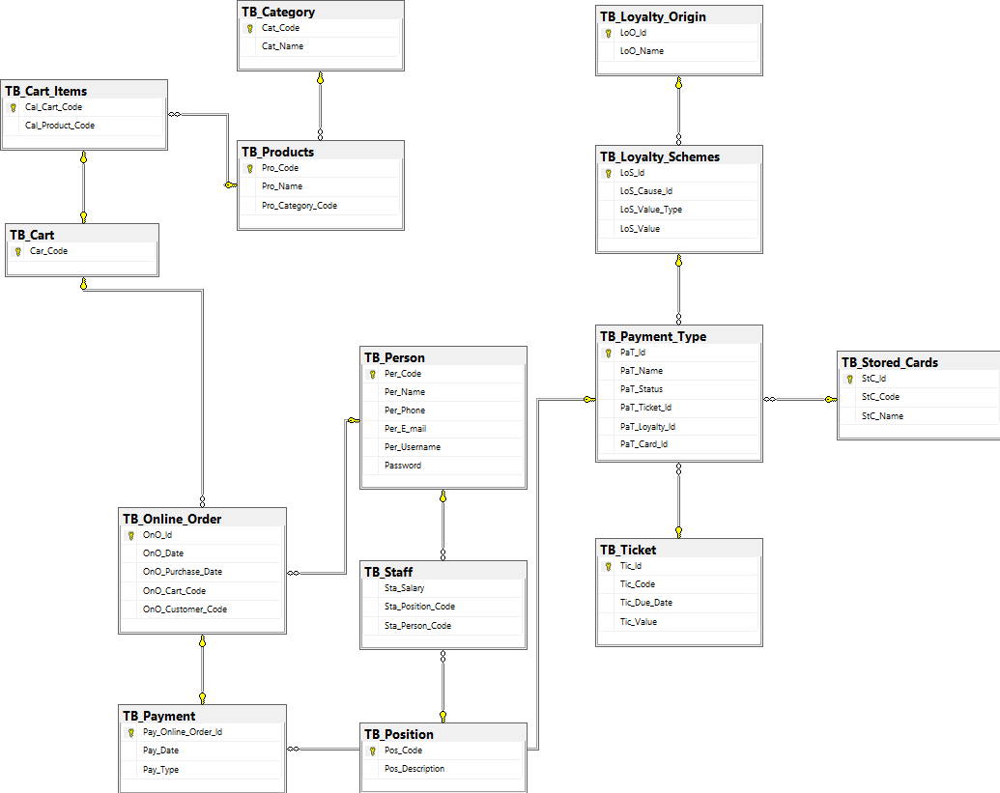

# Supermarket Lite

This is a personal project to practice class diagram implementation in Python (OOP) and the database using SQL (MySQL and SQL Server). 
* Directory 1: source -> contains files with OOP in Python
* Directory 2: sql -> contains the normalization (3fn) of the database in two versions: MySQL and SQL Server. The goal is to practice the syntax differece between these two tools. 
* Directory 3: diagrams -> contains: a) EER diagram created in SQL Server (EER_Diagram_SQL_Server.png), b) Class diagram created with StarUML (Supermarket_Class_Diagram_UML.png)
 
## Directory 3: Diagrams  

### a) EER diagram created in SQL Server (EER_Diagram_SQL_Server.png)

### b) Class diagram created with StarUML

The class diagram has 8 classes. I have applied generalization, composition, aggregation, and direct association.  Next, I describe the four different diagram relationships and indicate the classes of the Supermarket diagram that belong to each category. 

Generalization/inheritance:    

* People & Staff (the attributes listed in the class "People" are applied to the class Customers) 
* People & Customers (the attributes listed in the class "People" are applied in the class Staff)       

Composition:  

* Customers & Shopping Cart (customer always has a shopping cart)
* Loyalty Schemes & Payment (loyalty schemes always create discounts in payments) 
* Customers & Online Order (customers always have online orders) 

Aggregation:  

* Products & Shopping Cart (Products can be included in Shopping Carts) 
* Shopping Cart & Online Orders (shopping carts can lead to payment or not because customer can give up)
* Customers & Payment (customers can finish payment or not)
* Customers & Loyalty Schemes (customers can have loyalty schemes or not)
* Online Orders & Payment (Online orders can lead to payment or not)

Direct Association: Refers to a directional relationship represented by a line with an arrowhead.

* Staff  & Online Orders  (Staff members manage Products)

