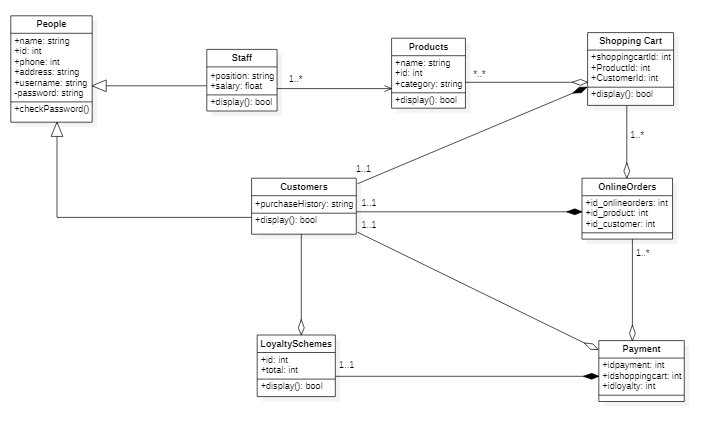

#Supermarket Lite

 
This class diagram has 8 classes. I have applied generalization, composition, aggregation, and direct association. THis repository contains the implementation in Python and the database using SQL. 

Next, I describe the four different diagram relationships and indicate the classes of the Supermarket diagram that belong to each category. 
 
1)      Generalization/inheritance:    

* People & Staff (the attributes listed in the class "People" are applied to the class Customers) 
* People & Customers (the attributes listed in the class "People" are applied in the class Staff)       

2)    Composition:  

* Customers & Shopping Cart (customer always has a shopping cart)
* Loyalty Schemes & Payment (loyalty schemes always create discounts in payments) 
* Customers & Online Order (customers always have online orders) 

3)      Aggregation:  

* Products & Shopping Cart (Products can be included in Shopping Carts) 
* Shopping Cart & Online Orders (shopping carts can lead to payment or not because customer can give up)
* Customers & Payment (customers can finish payment or not)
* Customers & Loyalty Schemes (customers can have loyalty schemes or not)
* Online Orders & Payment (Online orders can lead to payment or not)

4)      Direct Association: Refers to a directional relationship represented by a line with an arrowhead.

* Staff  & Online Orders  (Staff members manage Products)

